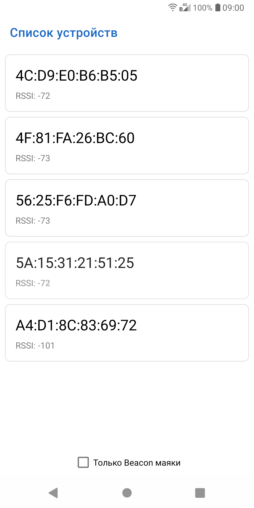
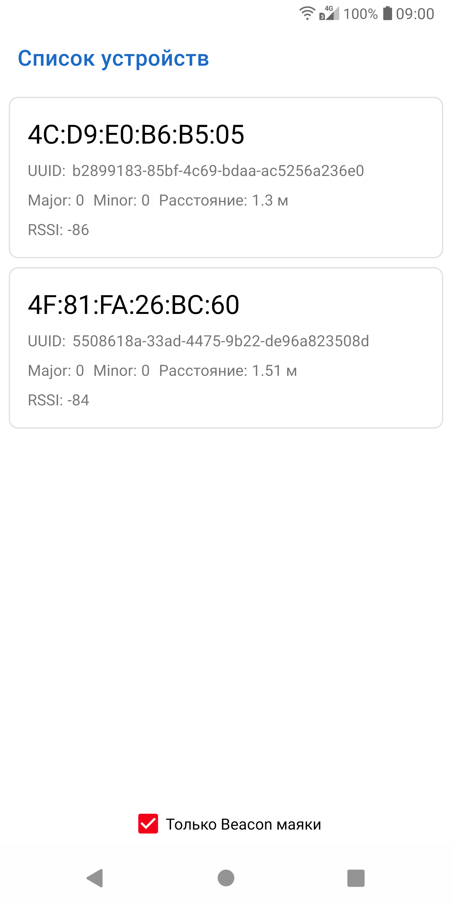
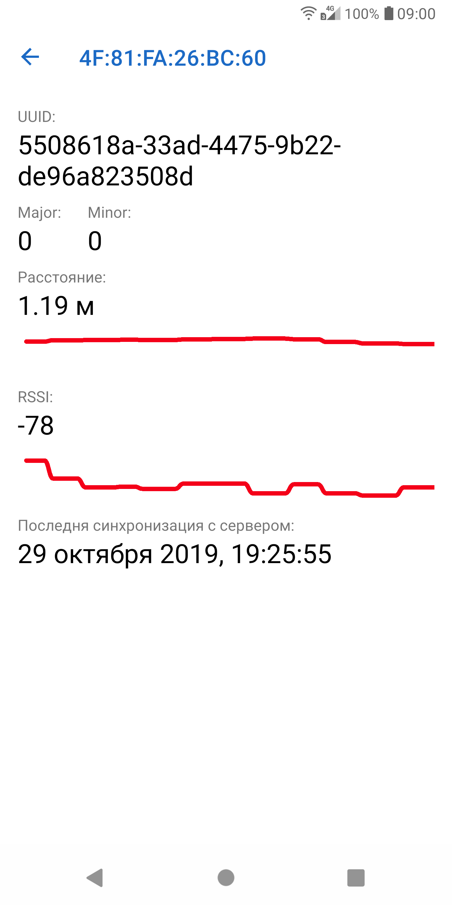

# BeaconFinder
Приложение для обнаружения ближайших Bluetooth LE iBeacon/altBeacon маяков

  

## В проекте реализованы:
- Непрерывный поиск доступных Bluetooth LE устройств поблизости
- Возможность переключения между всеми BLE устройствами и Beacon маяками в частности
- Обновление списка маяков в зависимости от расстояния в реальном времени
- Экран с деталями о маяке (UUID, major, minor, расстояние, RSSI, последняя синхронизация с сервером)
- Рисование графиков RSSI и расстояния в реальном времени
- ~~Сглаживание графиков путем интерполяции сплайнами~~
- ~~Синхронизация маяка с сервером:~~ [BeaconFinderService](https://github.com/hotmule/BeaconFinderService)

## В проекте используются:
- [Android Jetpack Components](https://developer.android.com/jetpack)
  - [MVVM](https://developer.android.com/topic/libraries/architecture/viewmodel)
  - [Navigation](https://developer.android.com/guide/navigation/)
  - [Room](https://developer.android.com/topic/libraries/architecture/room)
  - [Live Data](https://developer.android.com/topic/libraries/architecture/livedata)
  - [Data Binding](https://developer.android.com/topic/libraries/data-binding/)
- [Kotlin](https://kotlinlang.org/)
  - [Coroutines](https://kotlinlang.org/docs/reference/coroutines-overview.html)
- [Retrofit](https://square.github.io/retrofit/)
- [Koin](https://insert-koin.io/)
- [Custom View](https://developer.android.com/guide/topics/ui/custom-components)
- [AltBeacon](https://altbeacon.github.io/android-beacon-library/samples.html)
